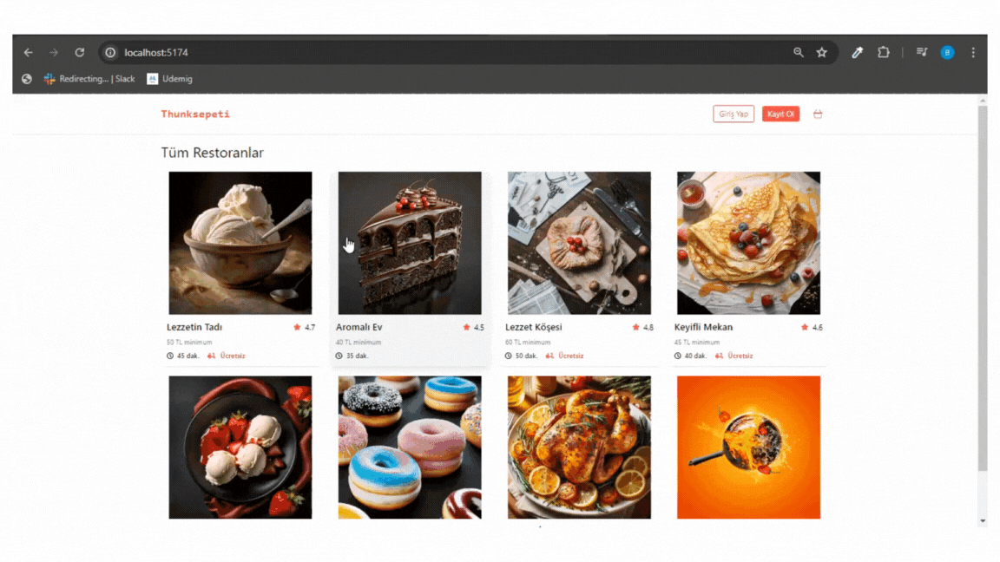

# Kütüphaneler

- react-router-dom
- json-server
- axios
- redux
- react-redux
- redux-thunk
- tailwind
- react-icons

# Package.json

- "server": "json-server --watch db.json --port 3003"

# Yemek Sepeti 

- Yemek Sepeti Projesi, kullanıcılara restoranları görüntüleme, menülerinden yemek siparişi verme ve siparişlerini yönetme imkanı sunan bir uygulamadır. Bu proje, Redux Thunk kullanılarak geliştirilmiş olup, Redux ile asenkron işlemleri yönetmeyi amaçlamaktadır. 

## Özellikler 

- Restoran listesini görüntüleme

- Restoranların menülerini görüntüleme

- Sepete ürün ekleme ve çıkarma

- Sipariş oluşturma ve yönetme

- Kullanıcı kimlik doğrulama ve yetkilendirme

## Kullanılan Teknolojiler

- React: Kullanıcı arayüzü oluşturmak için

- Redux: Uygulama durumunu yönetmek için

- Redux Thunk: Asenkron işlemleri yönetmek için

- HTML, CSS, JavaScript: Uygulamanın temel 
yapısını oluşturmak için

- API: Restoran ve menü verilerini almak için 

## Gif 

